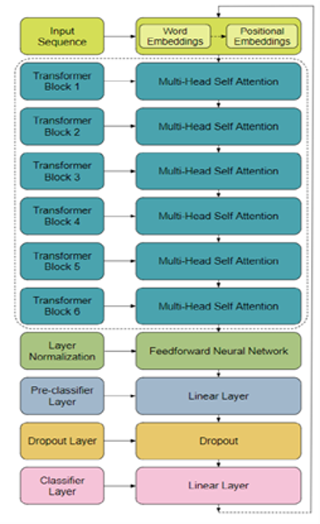
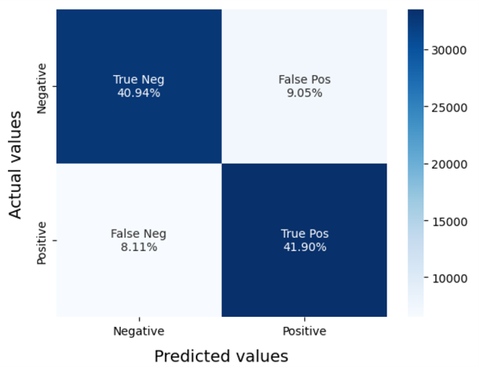
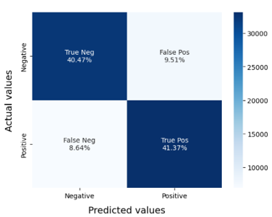

## Introduction
Sentiments represent feelings, opinions, and emotions. **Sentiment analysis** classifies text as positive, negative, or neutral, offering insights into public opinion. This process aids business decisions, brand reputation management, and product strategies.

## Problem Statement
Develop a sentiment analysis model using TF-IDF and DistilBERT to classify text content accurately as positive or negative.

## Objectives
- Classify sentiments as positive or negative.
- Compare TF-IDF’s Logistic Regression and Linear SVC models by accuracy, precision, recall, and F1 score.

## Methodology
**Preprocessing**: Lowercasing, URL & emoji substitution, username removal, non-alphanumeric removal, stopword removal, lemmatization.

**Comparison:**
- TF-IDF + Logistic Regression/Linear SVC
- DistilBERT
- Dataset split: 80% training, 20% testing

---

## Architecture

---

## Evaluation Metric
Evaluation metrics: **Accuracy**, **Precision**, **Recall**, **F1 Score**  
Confusion Matrix: Displays TP, TN, FP, and FN counts.

---

## Results

<table style="width: 100%; table-layout: fixed;">
  <tr>
    <th style="width: 50%;">TF/IDF with Logistic Regression Model</th>
    <th style="width: 50%;">TF/IDF with Linear SVC Model</th>
  </tr>
  <tr>
    <td style="width: 50%;"></td>
    <td style="width: 50%;"></td>
  </tr>
</table>

### TF-IDF Models:
- Logistic Regression accuracy: 82%
- Support Vector Machine (SVM) accuracy: 83%
- Limitations: lower accuracy compared to DistilBERT

### DistilBERT Model:
- Achieved superior accuracy of 86%
- Surpassed TF-IDF models in all metrics
- Ability to determine sentence sentiment probabilities
- Enhanced vocabulary range and prediction precision

### Table for Comparison of model performance

| Model        | Acc. (%) | TP (%) | FP (%) | FN (%) |
|--------------|----------|--------|--------|--------|
| Log. Reg.    | 82       | 41.9   | 9.05   | 8.11   |
| Linear SVC   | 83       | 41.37  | 9.51   | 8.64   |
| Distil-BERT  | 86       | -      | -      | -      |

---

## Conclusion and Future Scope
DistilBERT provides robust performance for sentiment analysis with high accuracy, suggesting its effectiveness over traditional models.
